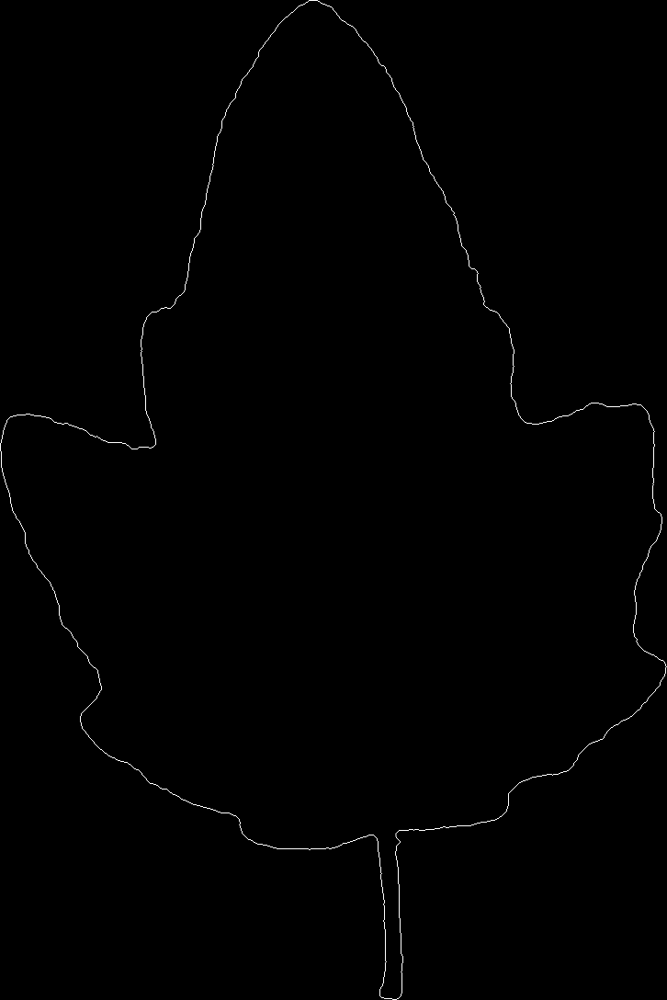
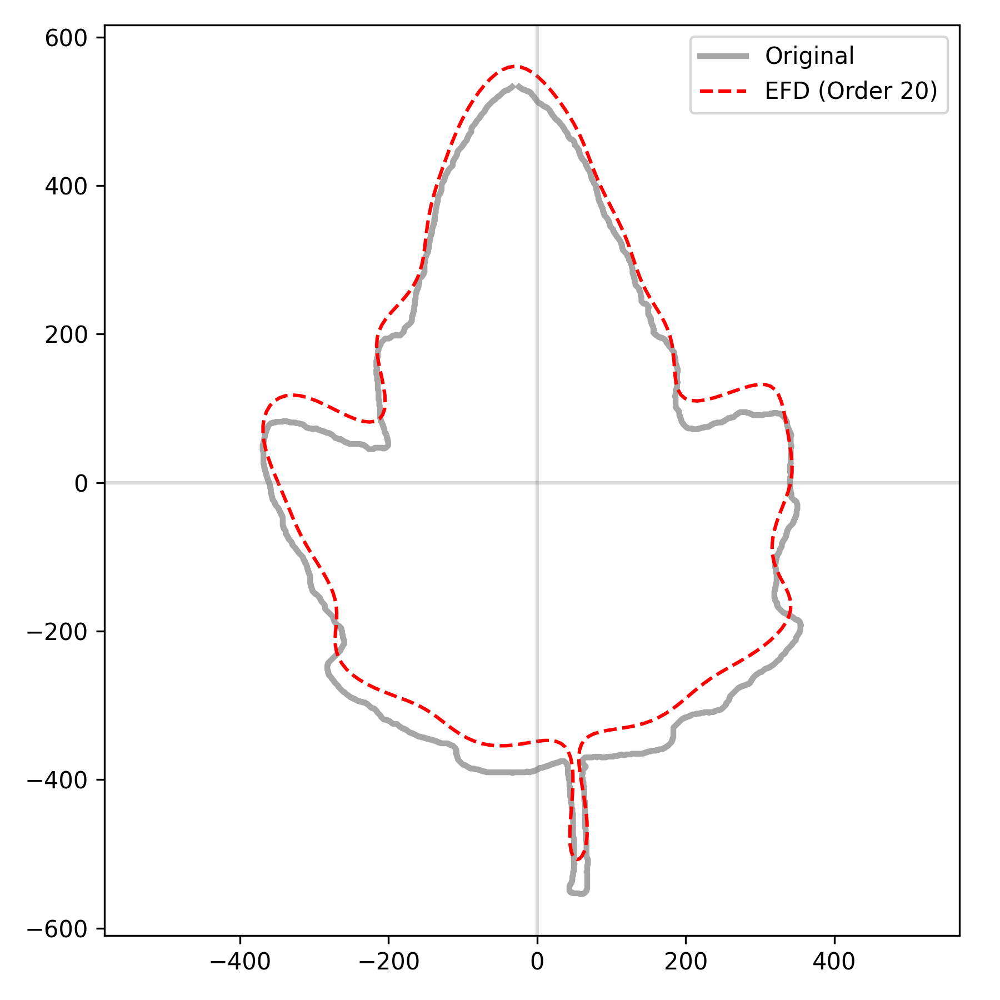
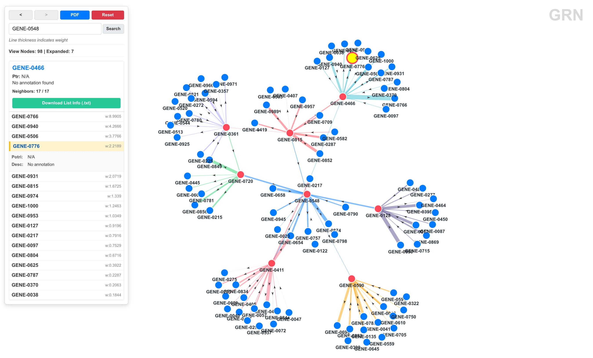

# jsrc

A CLI toolkit for data processing, analysis, and visualization.

For usage instructions, please refer to the [Documentation](docs/en/index.md).中文文档请参阅 [文档](docs/zh/index.md)。

## A Glance of jsrc's Functions

**vision module**

```bash
uv run jsrc vision extract -i test/leaf1.jpg -o test/efd --channel a --invert --save-mask
uv run jsrc vision efd -i test/efd -o test/efd --harmonics 20
```

Contour extraction & EFD reconstruction (20 harmonics):

 

EFD coefficients (first 5 rows):

```
an,bn,cn,dn
 0.7004,  0.0127, -0.0412,  1.0018
-0.0100, -0.0083, -0.0400,  0.0293
 0.0948, -0.0055, -0.0285, -0.1134
 0.0085, -0.0702,  0.0777, -0.0099
```

Morphological traits:

```bash
uv run jsrc vision traits -i test/leaf1.jpg --channel a --invert
```

| trait | value |
|-------|-------|
| area | 461833.5 |
| perimeter | 3479.84 |
| aspect_ratio | 0.671 |
| circularity | 0.479 |
| extent | 0.535 |
| solidity | 0.837 |

---

**grn module**

Generate 1000-gene random network viewer with full-view mode (top 200 nodes):

```bash
uv run jsrc grn net2json -i test/grn/network.tsv -o test/grn/json/grn.json -n test/grn/annotation.tsv -z test/grn/grn-viewer.zip -s
```



Centrality ranking (top 5):

```bash
uv run jsrc grn centrality -i test/grn/network.tsv --top 5
```

| rank | node | in_degree | out_degree | total_degree |
|------|------|-----------|------------|-------------|
| 1 | GENE_0504 | 24.14 | 34.97 | 59.12 |
| 2 | GENE_0785 | 26.37 | 29.51 | 55.88 |
| 3 | GENE_0165 | 42.81 | 12.21 | 55.01 |
| 4 | GENE_0394 | 14.82 | 33.04 | 47.86 |
| 5 | GENE_0427 | 36.50 | 10.60 | 47.10 |

---

**seq module**

```bash
uv run jsrc seq extract -fa test/seq/test.fa -gff test/seq/test.gff -ids test/seq/ids.txt -o test/seq/extracted.fa -feature gene -match ID
```

Extract sequences by gene ID from FASTA+GFF, rename via CSV map, run QC stats, k-mer counting, and sliding-window analysis.

QC: 2 sequences, 268 bp total, GC 56.7%, N50 160.

k-mer (k=3): top `ATC` (40), `TCG` (40), `CGA` (39).

---

**analyze module**

```bash
uv run jsrc analyze msa_consensus -fa test/analyze/aln.fa --json
uv run jsrc analyze snpindel -fa test/analyze/aln.fa
uv run jsrc analyze motif -fa test/analyze/aln.fa -o test/analyze/motif_out -minw 3 -maxw 5 -nmotifs 3
uv run jsrc analyze phylo -fa test/analyze/aln.fa -o test/analyze/tree.nwk
```

- Consensus: `ATGCTAGCTAGCTAGCTAGC`, mean conservation 0.983
- SNP: seq1 vs seq3 has 1 SNP (alignment score 19/20)
- Motif (top): `GCT` (12), `CTA` (12), `TAG` (12)
- Phylogeny: `(seq1:0.00000,seq2:0.00000,seq3:0.05000)Inner1:0.00000;`

---

**job module**

Submit, monitor, and inspect background jobs:

```bash
uv run jsrc job submit "echo 'job module test' && sleep 1 && echo done" -N test-job
```

```
job_id	1
pid	90288
log	/home/user/.local/share/jsrc/job-logs/1.log
status	running
```

```bash
uv run jsrc job ls --limit 5
```

```
job_id  status  pid    runtime  rss_mb  ...  command
------  ------  -----  -------  ------       ----------------------------------------------
1       exited  90288  4s       0.0         echo 'job module test' && sleep 1 && echo done
```

```bash
uv run jsrc job logs 1
```

```
job module test
done
```